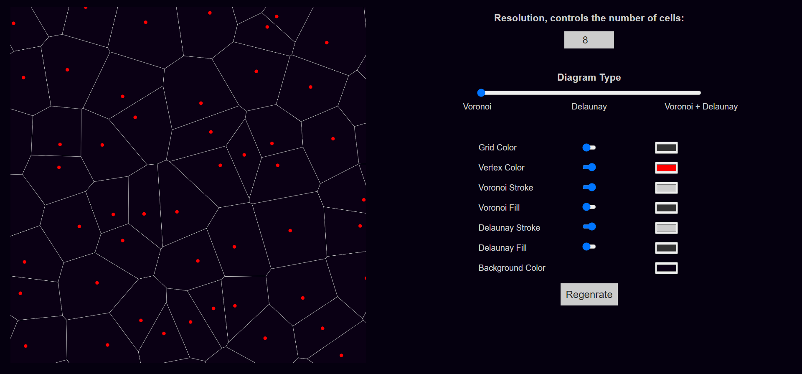
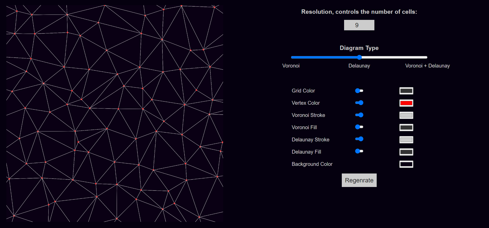
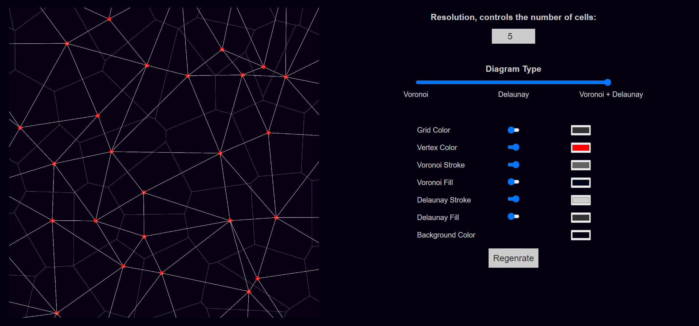

# Voronoi and Delaunay
## This is a grid based algorithm not the Fortune's algorithm.

#

#### This algorithm still needs some optimization improvements and some other improvements especially in the delaunay part 
#### Try it, play and interact with it on CodePen: <a href="https://codepen.io/moPsych/full/YzGNrWe">Voronoi and Delaunay</a>
#### This work is created with the help of the **p5js** JavaScript library.   
#### Feel free to do whatever you want with it.
#### Made with love ❤ by Mohammed Elsawy "moPsych".
#### *Cheers!*
